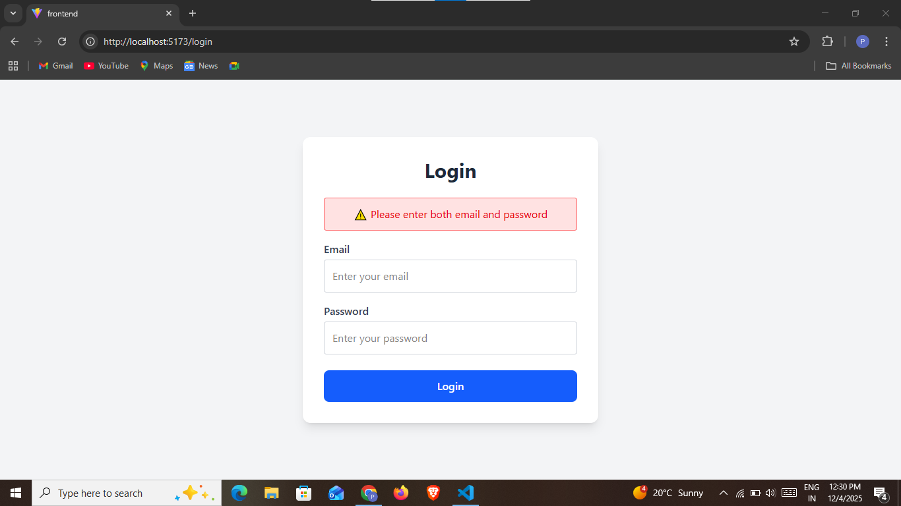
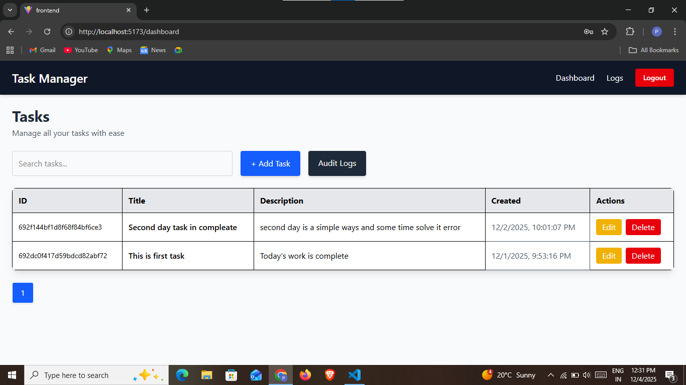
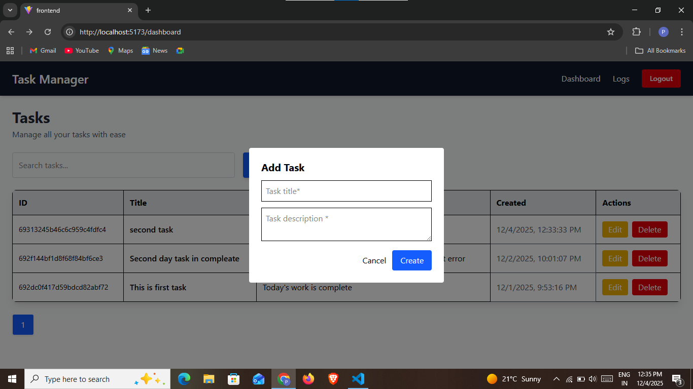
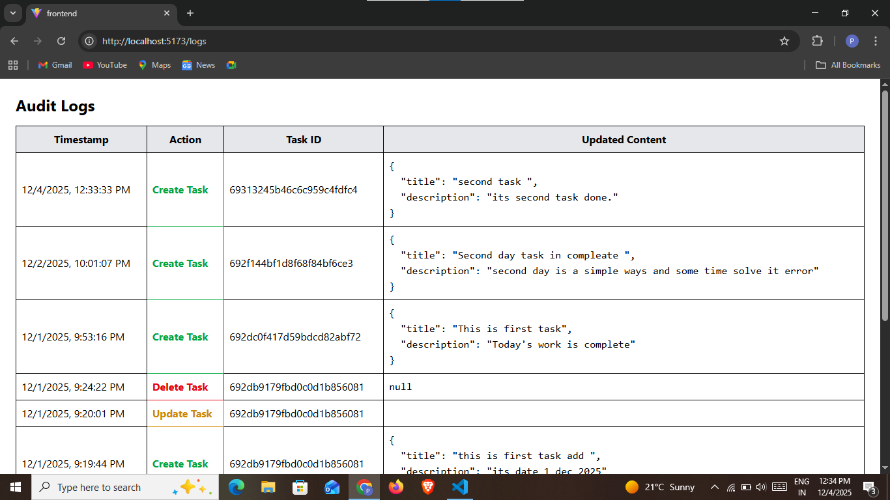

# 🏗 MERN Task Manager

 

A modern **Task Management Platform** built with the **MERN Stack**, featuring:

**CRUD tasks, Search, Pagination, Audit Logs, Authentication, and Responsive Tailwind CSS UI**.

---

## 🔐 Demo Credentials

| Field | Value |
|-------|-------|
| Email | admin@gmail.com |
| Password | password123 |

---

## ⚡ Features
- 🔑 Secure Authentication with protected routes  
- 📋 Tasks CRUD (Create, Read, Update, Delete) + Search + Pagination  
- 📜 Audit Logs with before/after values + timestamps  
- 🎨 Beautiful responsive UI with Tailwind CSS  
- 🖥 Easy folder structure & clean, readable code  

---

## 🛠 Tech Stack
- **Frontend:** React + Tailwind CSS + Axios  
- **Backend:** Node.js + Express.js  
- **Database:** MongoDB  
- **Auth:** Token-based (localStorage)  

---

## 📁 Folder Structure

    root/
├─ frontend/ # React app
├─ backend/ # Node + Express API
├─ screenshots/ # Screenshots for README
│ ├─ login.png
│ ├─ dashboard.png
│ ├─ task.png
│ └─ logs.png
├─ demo-video/ # Demo video (mp4)
└─ README.md

---

## 🔗 API Routes

### Tasks API
| Method | Route | Description |
|--------|--------|-------------|
| GET | /api/tasks | Fetch all tasks |
| POST | /api/tasks | Create task |
| PUT | /api/tasks/:id | Update task |
| DELETE | /api/tasks/:id | Delete task |

### Audit Logs API
| Method | Route | Description |
|--------|--------|-------------|
| GET | /api/logs | Fetch all logs |

---

## 📸 Screenshots

### Login Page

### Dashboard

### Tasks Page

### Audit Logs

---

## ▶️ Demo Video
[▶️ Watch Demo Video](./demo-video/demo.mp4)

---

## 🌟 Description (GitHub / Portfolio)
A professional **MERN Task Management Application** with:

- Full authentication flow  
- CRUD operations with search & pagination  
- Audit logs tracking changes  
- Clean Tailwind-based UI  
- Well-structured folder architecture  

Perfect for showcasing **full-stack skills** on GitHub or portfolio.

---

## 📝 Challenges
- Token-based authentication + UI state sync  
- Audit logs tracking previous & updated values  
- Responsive design with Tailwind CSS  

---

## 📞 Contact

